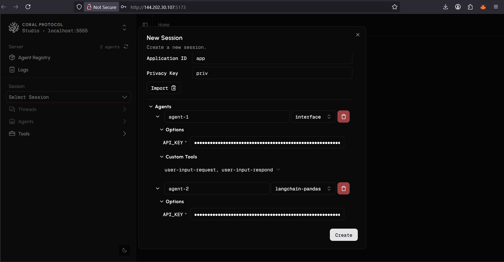
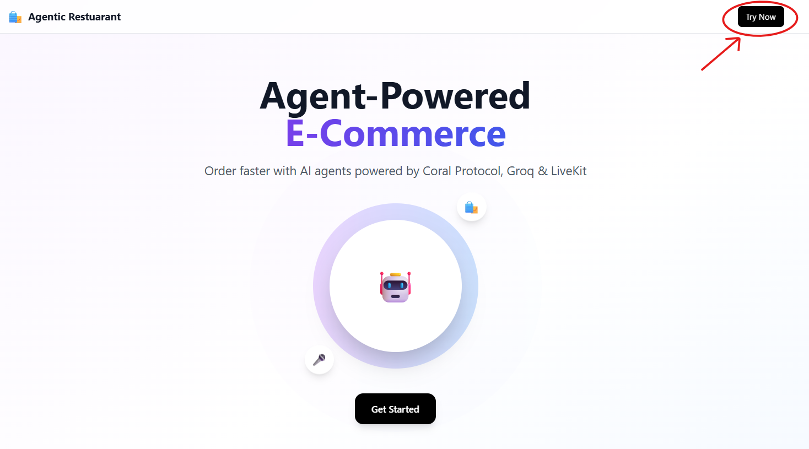
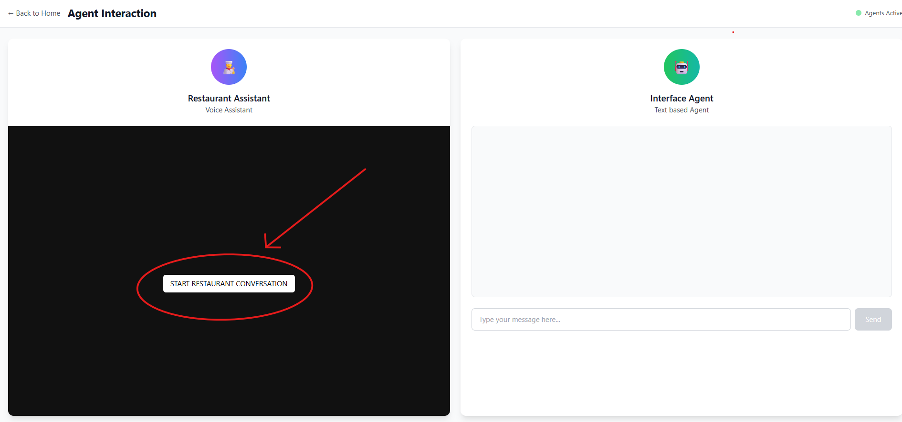

### Prosus Track: Restaurant Agentic System Webapp

- Restaurant voice agent system to provide an intelligent conversational experience for restaurant interactions.
- A voice-enabled system that handles customer reservations, takeaway orders, and payments without human staff intervention
- Uses Interface Agent to coordinate user instructions and Restaurant Voice Agent to manage real-time voice conversations across specialized functions
- Agents: [Interface Agent](https://github.com/Coral-Protocol/Interface-Agent-for-Webapp) | [Restaurant Voice Agent](https://github.com/Coral-Protocol/Restaurant-Voice-Agent)
- [Demo Video for custom UI](https://drive.google.com/file/d/1LtUfTUzV9MPEPY7b4alElDiJoml7E089/view)


  
### 1. Setup Coral Server and Coral Studio

<details>

- To setup the [Coral Server](https://github.com/Coral-Protocol/coral-server) and [Coral Studio UI](https://github.com/Coral-Protocol/coral-studio), follow the steps given in repository to install.

- In order to test if both are working, open the same instance in two terminals and run both simultaneously.

```bash
# run studio
yarn dev
```
- You will see both running like this simultaneously if succesful and should be able to access Coral Studio from your browser.


- On Coral Studio, ensure the connection to Coral Server.


<details>

<summary>Install Java if UNAVAILABLE in order to run Coral Server</summary>

Install Java

```bash

# Apt update
sudo apt update

# Install the JDK
sudo apt install openjdk-17-jdk

# Check version
java -version
```

Run Coral Server

```bash

./gradlew run

```

</details>

<details>

<summary>Install Yarn if UNAVAILABLE in order to run Coral Studio</summary>

Install Yarn

```bash
# Download and install nvm:
curl -o- https://raw.githubusercontent.com/nvm-sh/nvm/v0.40.3/install.sh | bash

# in lieu of restarting the shell
\. "$HOME/.nvm/nvm.sh"

# Download and install Node.js:
nvm install 22

# Verify the Node.js version:
node -v # Should print "v22.17.0".
nvm current # Should print "v22.17.0".

# Download and install Yarn:
corepack enable yarn

# Verify Yarn version:
yarn -v

# Install from yarn
yarn install

# Allow port for eternal access
sudo ufw allow 5173

```

Run Coral Studio

```bash

yarn dev

```

</details>

</details>

### 2. Setup the Agents

<details>  

- Terminate the Coral Server and Coral Studio connections from above and start below steps.
- In this example, we are using the agents: [Coral Interface Agent](https://github.com/Coral-Protocol/Coral-Interface-Agent) and [Restaurant Agent](https://github.com/Coral-Protocol/Restaurant-Voice-Agent).  
- Please click on the link and set up the agents by following the setup instructions in the repository.  
- Check the output below to see how the terminal will look after succesfull installation, keep in mind the directory you are at while doing `uv sync`.


</details>

### 3. Run the Agents:

<details>
 <summary>You can run it in three modes but Dev mode is preferable for begginer</summary>

<details>


<summary>Option 1: Agents running on executable with orchestrator on Coral-Studio:</summary>

- The Executable Mode is part of the Coral Protocol Orchestrator which works with [Coral Studio UI](https://github.com/Coral-Protocol/coral-studio).  

- Checkout: [How to Build a Multi-Agent System with Awesome Open Source Agents using Coral Protocol](https://github.com/Coral-Protocol/existing-agent-sessions-tutorial-private-temp).  

- Update the file: `coral-server/src/main/resources/application.yaml` with the details below. 

```bash
# Replace "root" with your project directory if different

applications:
  - id: "app"
    name: "Default Application"
    description: "Default application for testing"
    privacyKeys:
      - "default-key"
      - "public"
      - "priv"

registry:

  interface:
    options:
      - name: "API_KEY"
        type: "string"
        description: "API key for the service"
    runtime:
      type: "executable"
      command: ["bash", "-c", "/root/Coral-Interface-Agent/run_agent.sh main.py"]
      environment:
        - name: "API_KEY"
          from: "API_KEY"
        - name: "MODEL_NAME"
          value: "gpt-4.1"
        - name: "MODEL_PROVIDER"
          value: "openai"
        - name: "MODEL_TOKEN"
          value: "16000"
        - name: "MODEL_TEMPERATURE"
          value: "0.3"

  restaurant:
    options:
      - name: "API_KEY"
        type: "string"
        description: "API key for the service"
      - name: "LIVEKIT_URL"
        type: "string"
        description: "LIVEKIT URL"
      - name: "LIVEKIT_API_KEY"
        type: "string"
        description: "LIVEKIT API Key"
      - name: "LIVEKIT_API_SECRET"
        type: "string"
        description: "LIVEKIT API Secret"
      - name: "DEEPGRAM_API_KEY"
        type: "string"
        description: "Deepgram API Key"
      - name: "CARTESIA_API_KEY"
        type: "string"
        description: "Cartesia API Key"
    runtime:
      type: "executable"
      command: ["bash", "-c", "/root/Restaurant-Voice-Agent/run_agent.sh main.py console"]
      environment:
        - name: "MODEL_NAME"
          value: "gpt-4.1"
        - name: "MODEL_PROVIDER"
          value: "openai"
        - name: "API_KEY"
          from: "API_KEY"
        - name: "MODEL_TOKEN"
          value: "16000"
        - name: "MODEL_TEMPERATURE"
          value: "0.3"
        - name: "LLM_PROVIDER"
          value: "openai"
        - name: "LLM_MODEL"
          value: "gpt-4o-mini"
        - name: "OPENAI_API_KEY"
          from: "API_KEY"
        - name: "LIVEKIT_URL"
          from: "LIVEKIT_URL"
        - name: "LIVEKIT_API_KEY"
          from: "LIVEKIT_API_KEY"
        - name: "LIVEKIT_API_SECRET"
          from: "LIVEKIT_API_SECRET"
        - name: "DEEPGRAM_API_KEY"
          from: "DEEPGRAM_API_KEY"
        - name: "CARTESIA_API_KEY"
          from: "CARTESIA_API_KEY"

```

- Run the [Coral Server](https://github.com/Coral-Protocol/coral-server) and [Coral Studio](https://github.com/Coral-Protocol/coral-studio). 

- You do not need to set up the `.env` in the project directory for running in this mode; it will be captured through the variables below.  

- After the agents are loaded properly, you will see "2 agents" connected. Proceed ahead with "Select Session", add the agents, api key and esure to add both the Custom Tools to the Interface Agent.

 

</details>

<details>
  <summary>Option 2:Dev Mode(Running on terminal) </summary>
  - The Dev Mode allows the Coral Server and all agents to be seaprately running on each terminal without UI support.  

- Ensure that the [Coral Server](https://github.com/Coral-Protocol/coral-server) is running on your system and run below commands in separate terminals.

- Ensure that you have setup the `.env` file with required keys.
  
Make Sure you run both agents at approximately same time:

Run the Interface Agent

```bash
# cd to directory
cd Coral-Interface-Agent

# Run the agent using `uv`:
uv run python main.py
```

Run the Restaurant Agent

```bash
# cd to directory
cd Restaurant-Voice-Agent

# Run the agent using `uv`:
uv run main.py console
```
</details>

<details>


<summary>Option 3: Agents running without Coral-Studio and using custom UI:</summary>

Ensure that the [Coral Server](https://github.com/Coral-Protocol/coral-server) is running on your system

#### 1. Git clone the repository and install dependencies

```bash
# Clone the repository
git clone https://github.com/Coral-Protocol/Coral-RaiseYourHack-ProsusTrackExample

# Install `uv`:
pip install uv
```

##### For Coral Interface Agent
```bash
# Navigate to the interface agent agent directory
cd Interface-Agent-for-Webapp

# Install dependencies from `pyproject.toml` using `uv`:
uv sync
```

##### For Restaurant Agent
```bash
# Navigate to the monzo agent directory
cd Restaurant-Voice-Agent

# Install dependencies from `pyproject.toml` using `uv`:
uv sync
```

#### 2. Environment Configuration

##### For Coral Interface Agent
Get the API Key:
[Openai](https://platform.openai.com/api-keys)

Create a `.env` file in the `Interface-Agent-for-Webapp` directory based on the `.env_sample` file:
```bash
cd Interface-Agent-for-Webapp
cp -r .env_sample .env
# Edit .env with your specific configuration
```

##### For Restaurant Agent
Get the api key
GROQ_API_KEY=[Groq](https://console.groq.com/keys).

Note:
If you want to use cloud services by Livekit then use [Livekit Cloud](https://cloud.livekit.io/) for these api keys and url but for Self hosting you can check out there documentation for [Self Hosting](https://docs.livekit.io/home/self-hosting/local/).

LIVEKIT_API_KEY=your_livekit_api_key_here 
LIVEKIT_API_SECRET=your_livekit_api_secret_here  
LIVEKIT_URL=your_livekit_url_here 

Create a `.env` file in the `Restaurant-Voice-Agent` directory based on the `.env.example` file:
```bash
cd Restaurant-Voice-Agent
cp -r env.example .env
# Edit .env with your specific configuration
```
#### UI Frontend
To use the UI do this setup in a separate terminal:
```bash
cd UI
npm install
```
Create a `.env.local` file in the `UI` directory:
```bash
# Create .env.local with these variables:

# LiveKit Configuration
LIVEKIT_API_KEY=your_livekit_api_key_here 
LIVEKIT_API_SECRET=your_livekit_api_secret_here  
LIVEKIT_URL=your_livekit_url_here  

# API Endpoint Configuration (for Interface Agent)
NEXT_PUBLIC_CONN_DETAILS_ENDPOINT=/api/connection-details

# Interface Agent API Endpoint (default: http://localhost:8000)
NEXT_PUBLIC_INTERFACE_AGENT_API_ENDPOINT=http://localhost:8000
```

#### 3. Run Agents in Separate Terminals
Start all three components in their respective terminals:

#### Terminal 1: Start Coral Interface Agent
```bash
cd Interface-Agent-for-Webapp
uv run main.py
```

#### Terminal 2: Start Restaurant Voice Agent
```bash
cd Restaurant-Voice-Agent
uv run main.py dev
```

#### Terminal 3: Start UI Frontend
```bash
cd UI
npm run dev
```


### How to Connect to UI:

<details>

<summary>Click to expand UI app running instructions</summary>

- Access the Application: Open your browser and navigate to the UI application (typically http://localhost:3000)

- Try Now Button: Click the "Try Now" button to be directed to the main page



- Start Conversation: On the main page, press the "Start Restaurant Conversation" button for the restaurant agent



- Interact: You can now chat with the agentic system for restaurant-related queries and interactions

</details>

### How to use:

<summary>Click to expand sample input/output</summary>

<details>

#### 1. Input

```bash
Greet the restaurant agent by saying "Hi!".  
You can message the interface agent like this:  
Ask the restaurant agent to tell you the menu for the restaurant.  

You can also talk directly to the restaurant agent using voice, but only when it is not using the "wait for mentions" tool.
```

#### 2. Output

```bash
The restaurant agent will greet you and listen to your queries.  

When using the interface agent, it will communicate with the restaurant agent through Coral tools. The restaurant agent will reply to the interface agent.

For speech-based interaction, you need to talk to the restaurant agent directly.
```
</details>
</details>
</details>

